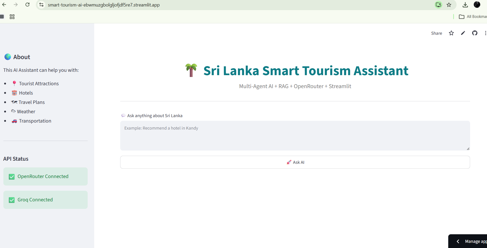
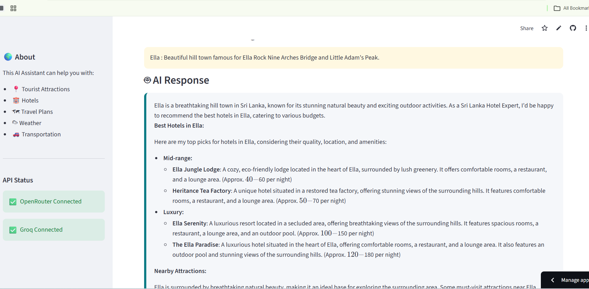
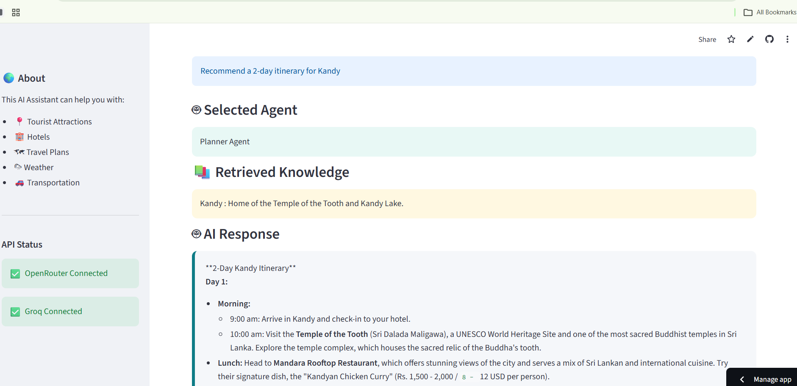
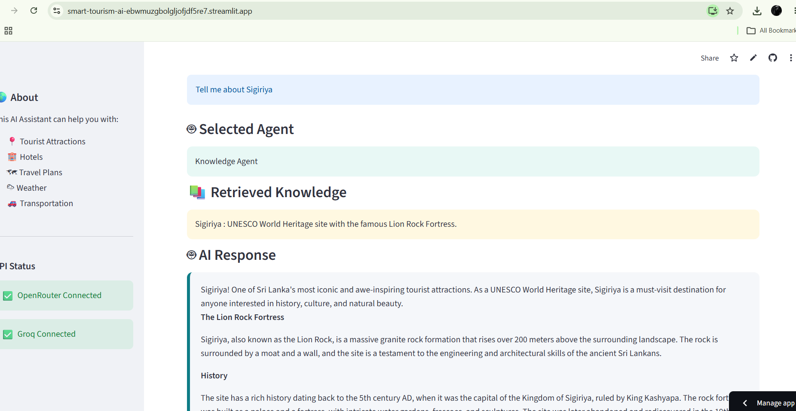

# 🌴 Sri Lanka Smart Tourism Assistant

## 📌 Project Description

Sri Lanka Smart Tourism Assistant is a Multi-Agent AI application developed using Streamlit, OpenRouter, Groq, and Retrieval-Augmented Generation (RAG). The system helps users plan trips, discover tourist attractions, recommend hotels, and answer tourism-related questions about Sri Lanka.

---

## 🚀 Features

- 🏨 Hotel Recommendations
- 🗺️ Travel Itinerary Planning
- 🌦️ Weather Information
- 📍 Tourist Attractions
- 🤖 Multi-Agent AI Routing
- 📚 Retrieval-Augmented Generation (RAG)

---

## 🏗️ System Architecture

```
User
   │
   ▼
Streamlit UI
   │
   ▼
LLM Service (Router)
   │
   ├── Planner Agent
   ├── Hotel Agent
   ├── Weather Agent
   └── Knowledge Agent
           │
           ▼
      RAG (ChromaDB)
           │
           ▼
Tourism Dataset
```

---

## 🤖 Agents

### Planner Agent
Creates travel itineraries.

### Hotel Agent
Provides hotel recommendations.

### Weather Agent
Answers weather-related questions.

### Knowledge Agent
Retrieves tourism knowledge using RAG.

---

## 🔄 Agent Communication

```
User
  │
  ▼
Router
  │
  ├── Planner Agent
  ├── Hotel Agent
  ├── Weather Agent
  └── Knowledge Agent
             │
             ▼
         RAG Database
             │
             ▼
      OpenRouter Response
```

---

## 🤖 AI Models

| Task | Model |
|------|-------|
| Intent Routing | Groq |
| Final Response Generation | OpenRouter |

### Why these models?

- Groq provides fast routing decisions.
- OpenRouter provides higher-quality final responses.

## 📊 Model Comparison

| Sub-task | Model | Provider | Reason |
|----------|-------|----------|--------|
| Intent Routing | Llama 3.1 8B | Groq | Very fast and low latency for routing user requests. |
| Final Response Generation | GPT OSS 120B | OpenRouter | Better reasoning and higher-quality responses for tourism assistance. |
| Knowledge Retrieval | ChromaDB + Sentence Transformers | Local | Efficient semantic search over tourism knowledge base. |

---

## 📚 RAG Pipeline

- Tourism dataset stored in CSV format.
- SentenceTransformer embeddings.
- ChromaDB vector database.
- Relevant knowledge retrieved before generating responses.

---

## 🛠 Technologies Used

- Python
- Streamlit
- LangChain
- OpenRouter
- Groq
- ChromaDB
- Sentence Transformers
- Pandas

---

## 📂 Project Structure

```
agents/
data/
rag/
services/
vector_db/
app.py
requirements.txt
```

---

## ⚙️ Installation

```bash
git clone https://github.com/Ashyy02/smart-tourism-ai.git

cd smart-tourism-ai

pip install -r requirements.txt

streamlit run app.py
```

---

## 🔑 Environment Variables

Create a `.env` file.

```
OPENROUTER_API_KEY=YOUR_KEY
GROQ_API_KEY=YOUR_KEY
```

---

## 🌐 Live Demo

Streamlit Cloud:

(https://smart-tourism-ai-ebwmuzgbolgljofjdf5re7.streamlit.app/)

---


## 📸 Screenshots

### Home Page


### Hotel Recommendation


### Travel Planner


### Knowledge


---

## ⚠ Known Limitations

- Weather information is not real-time.
- Knowledge depends on the tourism dataset.
- Internet connection is required.

---

## 👨‍💻 Author

**Name:** D.R.A.I.K. Dassanayake

**Student ID:** ITBIN-2313-0018

**Institution:** Horizon Campus

**Module:** IT41043 – Intelligent Systems (Agentic AI)

---

## 🙏 Acknowledgements

This project was developed as part of the Intelligent Systems (Agentic AI) module at Horizon Campus.

## 🚀 Future Improvements

- Real-time weather API integration
- Google Maps integration
- Voice assistant support
- Multi-language support
- Personalized travel recommendations